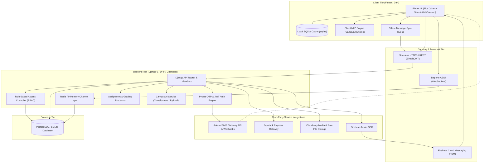
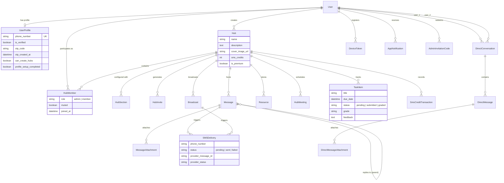

# CAMPUZ (TEKCHAT) ACADEMIC COMMUNICATION PLATFORM
## Comprehensive Technical Documentation, SRS, FRD, System Architecture & Defense Specification

---

## 1. Executive Summary & Project Overview

### 1.1 Project Identity & Background
- **Project Title:** Campuz (TekChat) Academic Communication Platform
- **Classification:** Decoupled, Cross-Platform Academic Communication & Collaboration Ecosystem
- **Target Audience:** Tertiary Institutions, Faculty Lecturers, Class Representatives, and Students
- **Core Technology Stack:** Flutter (Dart) for Client Mobile App; Django & Django REST Framework (Python) for Core Services; Django Channels (Daphne / WebSockets) for Real-Time State; PostgreSQL / SQLite for Persistence; Cloudinary for Cloud Media Assets; Arkesel SMS Gateway for Telecom Fallback; Paystack for Financial Transactions; Firebase Cloud Messaging (FCM) for Push Delivery; Hugging Face Transformers & Client NLP for Campus AI.

### 1.2 The Problem Statement: The Academic Communication Dilemma
Modern university campuses face a critical communication breakdown stemming from a mismatch of tools:
1. **The Casual Messaging Chaos (WhatsApp / Telegram):**
   - Critical academic broadcasts (venue shifts, lecture cancellations, exam timetables) are routinely submerged beneath social chatter, memes, and irrelevant media.
   - Group administration is disorganized: file uploads expire, links get lost, and students cannot systematically retrieve past slides, notes, or assignment prompts.
   - Strict class segregation is lacking: anyone can spam, and administrative controls are rudimentary.
2. **The Heavyweight LMS Alienation (Canvas / Blackboard / Moodle):**
   - Traditional Learning Management Systems (LMS) are desktop-oriented, cumbersome, and rarely provide instantaneous real-time interaction.
   - They rely 100% on continuous, high-bandwidth internet connectivity, which students in developing nations often lack.
3. **The Developing World Connectivity Divide:**
   - In regions where mobile data is metered and campus Wi-Fi fluctuates, students frequently experience data depletion.
   - When an urgent message is broadcasted over the internet, data-disconnected students miss it completely, leading to missed lectures, wasted transportation expenses, and academic penalties.

### 1.3 The Campuz Solution & Core Value Proposition
Campuz bridges the gap between the velocity of modern instant messaging and the structured rigor of an academic LMS through four foundational pillars:
1. **Dual-Channel Delivery Pipeline (IP + Telecom Fallback):** Real-time WebSocket and push notifications when internet is active; instant SMS fallback dispatch via the Arkesel telecom gateway for urgent announcements when students are offline.
2. **Structured Hub Architecture with Sectional Modularization:** Academic classes exist as isolated "Hubs" with designated roles (Admin vs. Member) and dedicated sub-channels: General Chat, Announcements, Resources, Meetings, and Tasks.
3. **Offline-First Resilience:** Client-side SQLite caching (`sqflite`) maintains an offline queue that stores draft messages and local changes, automatically syncing with the backend upon reconnection.
4. **Embedded Campus AI Engine:** Hybrid client-side and server-side NLP providing automated deadline extraction, lecture note summarization, study schedule planning, and native device calendar synchronization.

---

## 2. System Architecture & High-Level Design

---

## 3. Software Requirements Specification (SRS)

### 3.1 User Personas & Roles
1. **System Administrator (Superuser):**
   - Controls institution-level settings.
   - Generates single-use `AdminInvitationCodes` granting trusted educators and class representatives hub-creation privileges.
   - Audits telecom SMS logs and system-wide analytics.
2. **Hub Administrator (Lecturer / Class Representative):**
   - Creates and configures academic Hubs.
   - Customizes enabled sections (General, Announcements, Resources, Meetings, Tasks).
   - Issues hub invite codes and QR codes with expiry and usage limits.
   - Dispatches urgent broadcasts with SMS fallback flags.
   - Purchases SMS broadcast credit packages using Paystack.
   - Creates, collects, and grades student assignments.
3. **Hub Member (Student):**
   - Joins hubs via alphanumeric invite codes or camera QR scanning.
   - Participates in real-time chat, reactions, replies, and shared file downloads.
   - Submits assignment files/links and views grades/feedback.
   - Receives offline SMS notifications when data is unavailable.
   - Interacts with the Campus AI assistant to extract academic deadlines and sync meetings to their device calendar.

---

## 4. Functional Requirements Document (FRD)

| Requirement ID | Module / Feature Area | Functional Description | Implementation Artefacts |
| :--- | :--- | :--- | :--- |
| **FR-AUTH-01** | Phone-Based Authentication | System verifies user identity via E.164 mobile numbers and auto-generates a secure 6-digit OTP dispatched via Arkesel SMS. | `RequestOTPView`, `VerifyOTPView`, `UserProfile`, `OtpDeliveryLog` |
| **FR-AUTH-02** | JWT Token Lifecycle | Backend issues pair of stateless SimpleJWT tokens. Access token (30 days) and Refresh token (5 years) to mirror WhatsApp/Telegram persistent sessions. | `CustomTokenRefreshView`, `settings.SIMPLE_JWT` |
| **FR-AUTH-03** | Profile Setup & Discovery | Students configure display handles, real names, and avatars. Global contact syncing searches for registered peers via phone number hashes. | `ProfileSetupView`, `SyncContactsView`, `UserSearchView` |
| **FR-AUTH-04** | Admin Privilege Licensing | Hub creation is protected: users must redeem a unique `AdminInvitationCode` (e.g. `KNUST-CS-2026`) to unlock creator capabilities. | `AdminInvitationCode`, `UserProfile.can_create_hubs` |
| **FR-HUB-01** | Hub Lifecycle & Settings | Authorized users instantiate Hubs with custom titles, descriptions, and cover banners. | `HubViewSet`, `Hub`, `HubMember` |
| **FR-HUB-02** | Role-Based Access Control | Hub creator is designated `admin`; entrants join as `member`. Admins can mute members, edit metadata, or purchase SMS credits. | `HubMember.ROLE_CHOICES`, `HubMembershipView` |
| **FR-HUB-03** | Alphanumeric & QR Invites | Hubs generate secure invite tokens with expiration timestamps and maximum use counts. Supports in-app QR code generation and live camera scanning. | `HubInvite`, `HubInviteJoinView`, `qr_flutter`, `mobile_scanner` |
| **FR-HUB-04** | Modular Sections Architecture | Each Hub organizes academic content into 5 configurable sections: General, Announcements, Resources, Meetings, Tasks. | `HubSection`, `HubSectionViewSet` |
| **FR-MSG-01** | Real-Time WebSocket Messaging | Bi-directional messaging powered by Django Channels over WebSockets with presence indicators (online/offline) and live typing detection. | `ChatConsumer`, `routing.py`, `web_socket_channel` |
| **FR-MSG-02** | Threaded Replies & Media Attachments | Messages support parent-child nested replies and multipart file attachments (PDFs, Images, Audio, Documents) stored on Cloudinary. | `Message`, `MessageAttachment`, `DirectMessageAttachment`, `AutoCloudinaryStorage` |
| **FR-MSG-03** | 1-on-1 Direct Messaging | Peer-to-peer private conversations between students and lecturers with dedicated attachment pipelines and read receipts. | `DirectConversation`, `DirectMessage`, `DirectConversationView` |
| **FR-SMS-01** | Critical SMS Broadcast Fallback | When `send_as_sms` is flagged on an announcement, the backend debits Hub credits and dispatches the text to all members via Arkesel SMS. | `BroadcastViewSet`, `SMSDelivery`, `broadcast_sms_service.py` |
| **FR-SMS-02** | Arkesel Delivery Webhook Processing | Gateway posts delivery receipts (DELIVERED, FAILED) asynchronously to update delivery audit trails. | `SMSDeliveryWebhookView`, `SMSDelivery.provider_status` |
| **FR-PAY-01** | Paystack SMS Credit Top-Up | Hub admins initialize payments to buy SMS bundles; verified securely via Paystack verification APIs and webhooks. | `HubSmsTopUpInitializeView`, `HubSmsTopUpVerifyView`, `PaystackWebhookView` |
| **FR-RES-01** | Academic Resource Repository | Centralized repository categorized into PDFs, Documents, Videos, Links, and Archives with direct preview and local caching. | `Resource`, `ResourceViewSet`, `resources_screen.dart` |
| **FR-TSK-01** | Assignment & Submission Workflow | Instructors assign tasks with deadlines and files; students submit files/links; instructors assign grades and qualitative feedback. | `TaskItem`, `TaskViewSet`, `tasks_screen.dart` |
| **FR-CAL-01** | Session & Meeting Scheduling | Lecturers schedule virtual or physical meetings. Students can export dates directly to their native iOS/Android device calendar with one tap. | `HubMeeting`, `HubMeetingViewSet`, `add_2_calendar` |
| **FR-AI-01** | Campus AI Academic Engine | Dual-tier AI: client-side offline regex & keyword heuristics for immediate query answering, alongside server-side deep learning transformer models. | `CampusAiEngine`, `ai_service.py`, `AIChatView` |
| **FR-AI-02** | Automated Deadline Extraction | AI parses freeform announcements (e.g. "Assignment due this Friday by 5pm") and generates structured deadline entries. | `deadline_extractor.py`, `CampusAiEngine` |
| **FR-NOTIF-01** | Firebase Push Notifications | Device tokens are registered; background notifications are broadcasted on incoming messages, announcements, and task grades. | `DeviceToken`, `AppNotification`, `push_service.py` |
| **FR-OFF-01** | Offline Data Caching & Auto-Sync | All hubs and messages are persisted in local SQLite. Outgoing offline messages are held in an `offline_queue` and synced once online. | `DatabaseHelper`, `sqflite`, `AuthApiService.syncOfflineQueue` |

---

## 5. Non-Functional Requirements (NFRD)

### 5.1 Performance & Latency
- **Real-Time Message Propagation:** WebSocket message distribution across Hub subscribers must achieve a latency of $< 250\text{ ms}$ under nominal loads.
- **API Response Time:** 95% of standard CRUD REST endpoints (`/api/hubs/`, `/api/resources/`) must respond in $< 200\text{ ms}$.
- **Cold Start & Token Refresh:** Mobile authentication validation and token refresh must execute in $< 500\text{ ms}$.

### 5.2 Reliability & High Availability
- **Dual-Channel Delivery Guarantee:** In the event of cellular data network failure, critical announcements must achieve a $99.5\%$ delivery rate via GSM SMS fallback.
- **Resilient Offline Queue:** Messages queued while offline must persist through application termination, phone reboots, and crash states without data corruption.

### 5.3 Security, Privacy & Compliance
- **Cryptographic Authentication:** Zero plaintext password storage. Authentication relies on cryptographically pseudorandom 6-digit OTPs expiring within 5 minutes, backed by Argon2/PBKDF2 password hashes for standard Django users.
- **Stateless Authorization:** Every protected REST request and WebSocket handshake enforces JWT verification via the `Authorization: Bearer <token>` header or encoded query string.
- **Tenant Isolation (Hub Scoping):** Strict database-level query filtering ensures users can only read, write, or listen to WebSocket channels for Hubs in which they hold active `HubMember` records.
- **Data Protection:** Media uploads are routed through secured Cloudinary signed uploads; sensitive API keys (Arkesel, Paystack, Firebase, Cloudinary) are isolated in environment configuration files (`.env`).

### 5.4 Usability & Aesthetics
- **Consistent Visual Design System:** Custom AIM-inspired palette (Primary: `#B10E15` Crimson, `#6E070B` Dark, `#F7F1EF` Warm Canvas, `#3A1C1D` High-Contrast Typography).
- **Modern Typography:** Standardized on Google Fonts **Plus Jakarta Sans** across display, heading, body, and caption tiers.
- **Full Dark Mode Support:** Context-sensitive reactive theme toggling (`ThemeNotifier`) dynamically switching contrast levels for OLED and night-time study sessions.

---

## 6. Database Entity-Relationship Architecture

---

## 7. Comparative Technical Benchmark

| Capability / Metric | Traditional WhatsApp Groups | Standard LMS (Canvas/Moodle) | Slack / Discord | Campuz Academic Platform |
| :--- | :--- | :--- | :--- | :--- |
| **Offline Delivery (No Internet)** | ❌ Complete Failure | ❌ Complete Failure | ❌ Complete Failure | ✅ **Automatic SMS Telecom Fallback** |
| **Academic Content Structure** | ❌ Flat, Chaotic Stream | ⚠️ Deep, desktop-centric | ⚠️ Threaded channels | ✅ **Sectional Hubs (Tasks, Notes, Talks)** |
| **Assignment Lifecycle & Grading** | ❌ None | ✅ Complete | ❌ None | ✅ **Lightweight Mobile Submissions & Grades** |
| **Calendar & Timetable Integration**| ❌ Manual copying | ⚠️ iCal web sync | ⚠️ Bot plugins required | ✅ **Native Device 1-Tap Calendar Export** |
| **Academic AI Assistance** | ❌ None | ❌ Third-party add-on | ⚠️ Paid extensions | ✅ **Embedded Client NLP & Transformers** |
| **Privacy & Phone Number Exposure** | ❌ Exposed to all members | ✅ Hidden behind IDs | ✅ Hidden behind handles | ✅ **Role-Scoped Profile Visibility** |
| **Data Footprint & Bandwidth** | ⚠️ Heavy auto-downloads | ❌ High overhead | ❌ High RAM/Battery | ✅ **Optimized SQLite Offline Cache** |

---

## 8. Academic Project Defense Guide & Viva Voce Q&A

This section equips the student with articulate, technically rigorous answers for anticipated defense examination questions.

### Q1: "Why did you build a new platform instead of using WhatsApp or Telegram groups?"
> **Examiner Intent:** Testing whether the project solves a genuine technical problem or merely clones existing software.  
> **Model Answer:**  
> *"While WhatsApp is ubiquitous, it was architected for informal, consumer-grade messaging, not academic workflows. In an academic environment, WhatsApp fails in three major ways:  
> First, **information entropy**: critical announcements from instructors are buried under conversational chatter and memes with no native categorization.  
> Second, **lack of academic primitives**: it lacks structured assignment submissions, grading pipelines, and categorized lecture notes repositories.  
> Most crucially, WhatsApp is **entirely dependent on active IP connectivity**. When students run out of mobile data or experience network blackouts, they miss critical schedule updates. Campuz solves this through our dual-channel architecture: combining real-time WebSockets with an automated GSM SMS fallback via the Arkesel gateway, guaranteeing that urgent announcements reach students regardless of internet availability."*

### Q2: "How does the Offline-First architecture work when the student has no internet?"
> **Examiner Intent:** Evaluating understanding of local state persistence, conflict resolution, and data synchronization.  
> **Model Answer:**  
> *"Campuz implements a two-pronged offline strategy on the client using Flutter and `sqflite`:  
> 1. **Read Persistence:** All Hub metadata, sectional content, and historical chat messages are serialized into local SQLite tables whenever fetched. If the application is launched in airplane mode or with no connectivity, the UI immediately loads from the SQLite cache.  
> 2. **Write Persistence & Sync Queue:** When a student creates an item (such as composing a message), the system detects connection failure, commits the record into a dedicated `offline_queue` table with timestamp and payload, and displays a pending indicator. The application listens to network connectivity streams and calls `AuthApiService.syncOfflineQueue()` upon link re-establishment, flushing the queue to the backend via FIFO order."*

### Q3: "Explain your real-time messaging architecture. Why use Django Channels alongside Django REST Framework?"
> **Examiner Intent:** Testing architectural knowledge regarding HTTP request-response versus full-duplex socket protocols.  
> **Model Answer:**  
> *"Traditional Django operates on a synchronous WSGI request-response lifecycle, which is ideal for standard CRUD operations like user registration, resource uploads, and assignment grading. However, real-time messaging requires bidirectional, low-latency, persistent connections.  
> We decoupled transport into:  
> - **DRF for stateless REST operations**, authenticated via JWT tokens.  
> - **Daphne and Django Channels (ASGI)** for WebSockets.  
> When a client connects to `ws/hubs/<hub_id>/`, the connection undergoes JWT handshake validation in `ChatConsumer`. The user joins a Channel Layer group. When any member posts a message, the server broadcasts it to the room group without expensive database polling, achieving latency under 200 milliseconds, complete with online presence and typing indicators."*

### Q4: "How does the system prevent financial abuse of the SMS Broadcast service?"
> **Examiner Intent:** Verifying rate-limiting, authorization security, and transaction integrity.  
> **Model Answer:**  
> *"SMS dispatch incurs real-world telecom carrier costs. We prevent abuse through three safeguards:  
> 1. **Role-Based Authorization:** Only members with the `admin` role in a Hub have permission to initiate an SMS broadcast.  
> 2. **Pre-Paid Credit Escrow Model:** Hubs possess an `sms_credits` counter. Before any broadcast request is dispatched to the Arkesel API, the backend evaluates `credits >= total_recipients`. If insufficient, the request is rejected with a 402 Payment Required status.  
> 3. **Cryptographic Webhooks:** SMS top-ups via Paystack and delivery callbacks from Arkesel validate HMAC-SHA512 webhook signatures, ensuring credits are only added upon confirmed bank settlement."*

### Q5: "What is the technical implementation of your Campus AI Engine?"
> **Examiner Intent:** Examining whether AI claims are authentic, practical, and resilient.  
> **Model Answer:**  
> *"The Campus AI Engine uses a hybrid architecture designed for performance and offline reliability:  
> On the client side in Dart (`CampusAiEngine`), we developed an offline-first rule and heuristic processor. It utilizes regex tokenizers, keyword extractors, and date parsers to perform instant intent classification (Greetings, Deadlines, Study Schedules, Exam Tips) and extract academic dates from natural announcements without requiring internet.  
> On the backend (`ai_service.py`), we implement Hugging Face Transformer pipelines (`torch`) capable of deep semantic summarization and question answering. When dates are identified, the system interfaces with the mobile device's platform channel via `add_2_calendar`, allowing students to insert lecture sessions and assignment deadlines directly into their native Google or Apple Calendars."*

---

## 9. Conclusion & Deliverables Summary
The Campuz Academic Communication Platform stands as an enterprise-grade, academically tailored software ecosystem. By combining high-performance mobile technologies (Flutter), scalable backend infrastructure (Django, DRF, Channels, PostgreSQL), telecom gateways (Arkesel SMS), financial pipelines (Paystack), and intelligent NLP services, the platform eliminates communication fragmentation and ensures educational equity across higher institutions.
